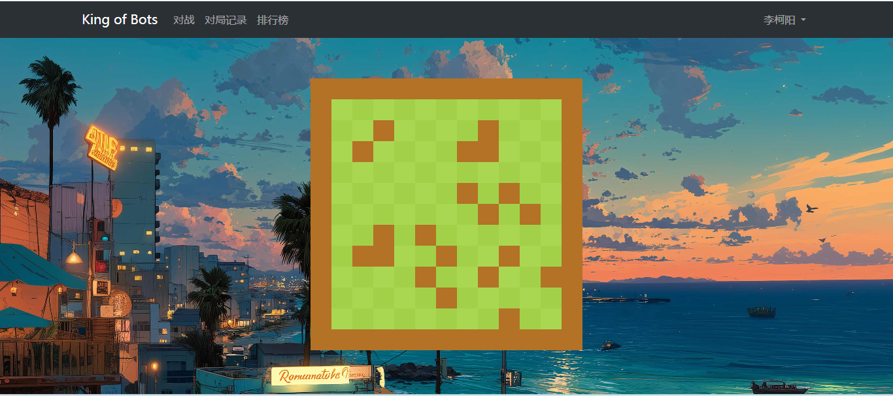

Spring Boot 框架搭建的《King of Bots》游戏，用于熟悉对后端的应用以及前后端的通信

错误点：

问题1.在后端项目建立后，尝试运行后在页面中显示`templates/index.html`文件时显示不出来，显示500错误；

解决1.检查application.properties文件中是否已经默认设定首页为`templates/your_profile_name.html`，这样了话仅返回.html文件名就好了 ==> `return "index"`;

问题2.在前端绘制地图的时候，图案绘制不出来；

解决2.先检查`Wall.js`有没有引用错误，需要引用`AcGameObject.js`才可以渲染页面；还需要检查`GameMap.js`中`check_connectivity()`函数有没有写错，在渲染障碍物的时候只有`new Wall(wall_row_position, wall_col_position, GameMap_Object)`才能够在页面中显示出来。

问题3：在测试蛇头移动的时候没有移动；

解决3：代码改为`this.cells[0].x += this.speed * this.time_delta / 1000;`，不要使用别的位置变量；

